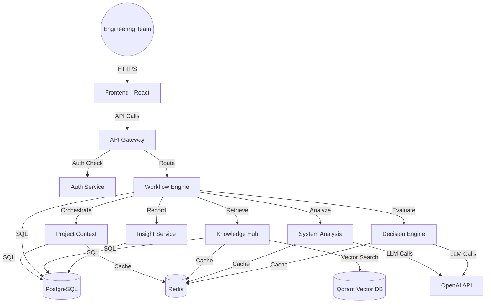

# Cognitive Dev Hub – AI-Powered Engineering Intelligence Platform

A unified, AI-powered engineering co-pilot and SaaS platform designed to support engineering teams throughout the entire technical decision lifecycle.

## 🚩 The Problem
Modern engineering teams face several critical challenges:
1.  **Information Overload**: Constant context switching between documentation, codebase, and Slack/Confluence makes it hard to maintain a "big picture."
2.  **Analysis Paralysis**: Evaluating new architectures or choosing between tech stacks (e.g., SQL vs. NoSQL) is time-consuming and prone to bias.
3.  **Knowledge Loss**: Technical decisions are often made in silos, leading to "architectural drift" where the original reasoning is lost.
4.  **Scaling Inefficiency**: Senior engineers spend excessive time answering the same questions instead of focusing on high-level strategy.

## 💡 The Solution
Cognitive Hub solves these problems by creating a centralized **Engineering Intelligence Layer**:
- **Automated Research**: Uses **RAG (Retrieval-Augmented Generation)** to ingest and search across project documentation, identifying patterns and constraints instantly.
- **AI-Powered Analysis**: Provides an objective evaluation of system designs, identifying bottlenecks and scalability issues *before* code is written.
- **Structured Decision Support**: Replaces ad-hoc choices with evaluated trade-off analyses, comparing alternatives side-by-side using AI-driven criteria.
- **Contextual Intelligence**: Maintains a persistent "Project Context" that guides all AI reasoning, ensuring recommendations are tailored to *your* specific tech stack and requirements.

### 💰 Value Proposition
- **Saves Time**: Reduces technical research and architecture review cycles from days to minutes.
- **Saves Money**: Prevents costly architectural mistakes by identifying scalability or reliability issues in the design phase.
- **Improves Quality**: Ensures decisions are based on data and structured trade-offs rather than "gut feeling" or industry hype.

## 🏗️ System Design & Architecture

Cognitive Hub is built as a **Distributed Microservices Mesh**, designed for high scalability, fault tolerance, and multi-tenant isolation.

### 🧩 Architectural Layers

1.  **Presentation Layer (Frontend)**: A React/TypeScript SPA that provides a seamless, dashboard-driven experience for engineering managers and architects.
2.  **Orchestration Layer (API Gateway & Workflow Engine)**: The **API Gateway** handles unified routing and authentication. The **Workflow Engine** coordinates complex, multi-step AI tasks asynchronously using Background Tasks.
3.  **Intelligence Layer (AI Services)**: 
    *   **System Analysis Service**: Specialized prompts and AI logic for evaluating architectures.
    *   **Decision Engine**: Quantitative and qualitative comparison of technical alternatives.
    *   **Knowledge Hub**: Vector-based retrieval (RAG) using OpenAI embeddings and Qdrant.
4.  **Data & State Layer**:
    *   **PostgreSQL**: Relational storage for metadata, projects, and tenant data.
    *   **Redis**: High-speed caching for AI responses and session state.
    *   **Qdrant**: High-performance vector database for semantic memory.

### 🔒 Security Design
- **JWT-based Authentication**: Secure access across all service boundaries.
- **Tenant-Aware Isolation**: Mandatory `tenant_id` validation at the middleware level for every database query and vector search.



## 📁 Project Structure

```
cognitive-dev-hub/
├── services/
│   ├── auth-service/          # Authentication & multi-tenant management
│   ├── project-context/       # Project metadata & context management
│   ├── workflow-engine/       # AI task orchestration
│   ├── knowledge-hub/         # RAG & semantic search
│   ├── system-analysis/       # Architecture analysis AI
│   ├── decision-engine/       # Decision support AI
│   ├── insight-service/       # Reporting & insights
│   └── api-gateway/           # Service routing & aggregation
├── frontend/                  # React-based web UI
├── shared/                    # Shared utilities & models
├── docker-compose.yml         # Local development setup
└── README.md
```

## 🚀 Getting Started

### Prerequisites

- Python 3.11+
- Node.js 18+
- Docker & Docker Compose
- PostgreSQL (or use Docker)
- Redis (or use Docker)

### Quick Start

```bash
# Start all services with Docker Compose
docker-compose up -d

# Or run services individually (see individual service READMEs)
```

## 🔧 Technology Stack

- **Backend**: Python, FastAPI, SQLAlchemy
- **Frontend**: React, TypeScript, Tailwind CSS
- **AI/ML**: OpenAI API, LangChain, Vector DB (Qdrant/Chroma)
- **Database**: PostgreSQL, Redis
- **Message Queue**: RabbitMQ/Celery
- **Containerization**: Docker

## 📚 Services Documentation

Each service has its own README with detailed documentation:
- [Auth Service](services/auth-service/README.md)
- [Project Context Service](services/project-context/README.md)
- [Workflow Engine](services/workflow-engine/README.md)
- [Knowledge Hub](services/knowledge-hub/README.md)
- [System Analysis Service](services/system-analysis/README.md)
- [Decision Engine](services/decision-engine/README.md)
- [Insight Service](services/insight-service/README.md)

## 🤝 Contributing

This is a portfolio project demonstrating enterprise-level AI platform architecture.

## 📄 License

MIT License

